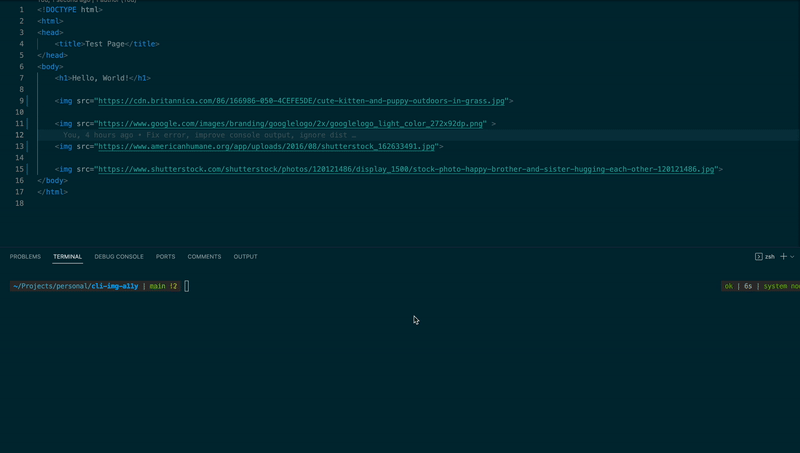

<div align="center">
  <h1>cli-a11y-ai</h1>
  <p>A CLI tool to enhance web accessibility by auto-generating descriptive alt text for <code>img</code> tags in HTML, TSX, JSX, JS, TS, MD, and MDX files using AI technology.</p>
  
  <a href="https://www.npmjs.com/package/cli-a11y-ai"></a>
</div>

## Table of Contents

- [Introduction](#introduction)
- [Features](#features)
- [Installation](#installation)
- [API Key Requirement](#api-key-requirement)
- [Usage](#usage)
- [With an API Key](#with-an-api-key)
- [Command Options](#command-options)
- [Model Accuracy and Limitations](#model-accuracy-and-limitations)
- [Future Scope](#future-scope)
- [Contributing](#contributing)
- [License](#license)

## Introduction

`cli-a11y-ai` is a command-line tool designed to automatically add alternative text (alt text) to image tags in files. It scans HTML, TSX, JSX, JS, TS, MD, and MDX files, identifying images without alt attributes and uses the BLIP (Bootstrapping Language-Image Pre-training) AI model to generate relevant descriptions, enhancing both accessibility and SEO.

## Features

- **Accessibility Improvement**: Adds alt text to images, making web content more accessible to users with visual impairments.
- **SEO Enhancement**: Helps in better indexing of images by search engines.
- **Developer Productivity**: Automates the repetitive task of writing alt text, saving time for developers.

## Installation

You can install `cli-a11y-ai` globally using npm:

```bash
npm install -g cli-a11y-ai
```

Or with Yarn:

```bash
yarn global add cli-a11y-ai
```

## API Key Requirement

`cli-a11y-ai` requires an API key from Replicate to function. You can obtain an API key by signing up on the [website](https://replicate.com/).

## Usage

To use the tool in your project, navigate to your project directory and run:

```bash
cli-a11y-ai
```

## With an API Key

If you have a Replicate API key, you can pass it as a command-line argument:

```bash
cli-a11y-ai -k YOUR_API_KEY
```

## Command Options

- `-k, --api-key <key>`: Specifies the API key for the Replicate service.

## Model Accuracy and Limitations

The accuracy of alt text generation depends on the AI model provided by Replicate. While the model strives for accuracy, it's important to review the generated alt texts as they may not always perfectly describe the image content.

## Future Scope

Future versions plan to extend functionality to support different types of image tags (e.g., `<image>`, `<Image>`) and integrate more sophisticated AI models for alt text generation. It can also be extended to provide text suggestions for other accessibility attributes such as `aria-label` and `aria-labelledby`.

## Contributing

Your contributions are welcome! Please read our [Contributing Guidelines](./CONTRIBUTING.md) for more information on how to get involved.

## License

cli-a11y-ai is MIT licensed. See the [LICENSE](./LICENSE) file for details.
